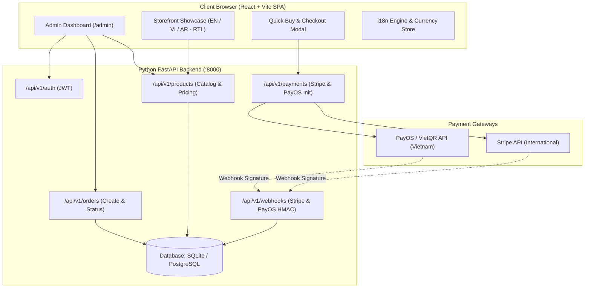
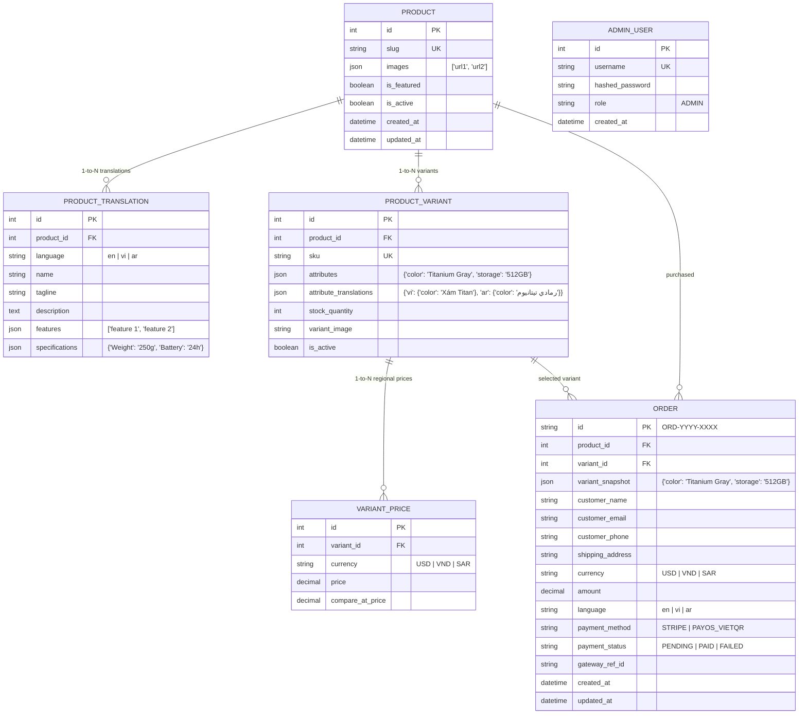

# Design Specification: Multilingual & Multi-Currency E-Commerce Showcase Platform

- **Date:** 2026-09-26
- **Status:** Approved
- **Target Tech Stack:** Python 3.14 (FastAPI, SQLAlchemy, Pydantic) + Modern React (Vite, TailwindCSS / CSS Modules, Framer Motion) + SQLite/PostgreSQL

---

## 1. Executive Summary

Hệ thống là một nền tảng thương mại điện tử giới thiệu sản phẩm cao cấp (Luxury Product Showcase) tương tự trải nghiệm của Apple Store và Shopify Plus. Hệ thống đáp ứng:
1. **Trải nghiệm đa ngôn ngữ (i18n)**: Tiếng Anh (Mỹ - `en-US`), Tiếng Việt (`vi-VN`), Tiếng Ả Rập (`ar-SA`).
2. **Hỗ trợ RTL (Right-to-Left)**: Giao diện tự động đảo chiều từ phải sang trái cho Tiếng Ả Rập, sử dụng bộ font thư pháp hiện đại (Cairo).
3. **Đa tiền tệ và Định giá theo vùng (Fixed Regional Pricing)**: Tự động đồng bộ loại tiền tệ và đơn giá chuẩn khi chuyển đổi ngôn ngữ/quốc gia (USD `$`, VND `₫`, SAR `﷼`), tránh số lẻ tỷ giá và chủ động biên lợi nhuận.
4. **Cổng thanh toán kép (Hybrid Payment Gateways)**:
   - Quốc tế: **Stripe** (Thẻ tín dụng Visa/MasterCard, Apple Pay, Google Pay).
   - Nội địa Việt Nam: **PayOS / VietQR** (Quét mã QR ngân hàng tự động đối soát Napas 24/7).
   - Cơ chế Webhook an toàn với xác thực chữ ký số HMAC và xử lý idempotent (chống trừ kho hai lần).
5. **Trang Quản trị tích hợp (Admin Dashboard)**: Đăng nhập bảo mật JWT, quản lý sản phẩm, dịch nội dung đa ngôn ngữ, thiết lập giá 3 thị trường, quản lý biến thể/tồn kho và theo dõi lịch sử đơn hàng theo thời gian thực.

---

## 2. System Architecture



### Phân chia cấu trúc dự án:
```text
Build Website/
├── backend/                        # FastAPI Backend
│   ├── app/
│   │   ├── api/v1/
│   │   │   ├── auth.py             # Admin Login & JWT verification
│   │   │   ├── products.py         # Product & Variant CRUD, public catalog
│   │   │   ├── orders.py           # Order creation & status query
│   │   │   ├── payments.py         # Stripe Session & PayOS Link generation
│   │   │   └── webhooks.py         # Stripe & PayOS webhook listener
│   │   ├── core/
│   │   │   ├── config.py           # Settings (.env variables)
│   │   │   └── security.py         # Password hashing & JWT tokens
│   │   ├── models/                 # SQLAlchemy ORM Models
│   │   │   ├── product.py
│   │   │   ├── order.py
│   │   │   └── user.py
│   │   ├── schemas/                # Pydantic Schemas
│   │   │   ├── product.py
│   │   │   ├── order.py
│   │   │   └── payment.py
│   │   └── db/
│   │       ├── session.py          # DB Engine & sessionmaker
│   │       └── seed.py             # Seed sample luxury products & admin account
│   ├── main.py                     # App entry point, CORS, routers
│   ├── requirements.txt
│   └── .env.example
│
├── frontend/                       # React + Vite Frontend
│   ├── public/
│   │   └── locales/                # i18n JSON files (en, vi, ar)
│   ├── src/
│   │   ├── components/
│   │   │   ├── navbar/             # Language & Currency selector, brand logo
│   │   │   ├── showcase/           # Hero visual, Variant Picker, Bento Grid, Tech Specs
│   │   │   ├── checkout/           # Quick Buy Modal, VietQR popup, Stripe checkout trigger
│   │   │   └── admin/              # Dashboard metrics, Product Editor, Order table
│   │   ├── contexts/
│   │   │   ├── LanguageContext.jsx # en/vi/ar state, sets document.dir & fonts
│   │   │   └── CurrencyContext.jsx # USD/VND/SAR state, formatters
│   │   ├── pages/
│   │   │   ├── HomePage.jsx        # Storefront
│   │   │   ├── OrderSuccessPage.jsx
│   │   │   └── AdminPage.jsx
│   │   ├── services/api.js         # Axios / Fetch client
│   │   ├── styles/globals.css      # CSS Logical properties, animations, RTL rules
│   │   ├── App.jsx
│   │   └── main.jsx
│   ├── package.json
│   └── vite.config.js
└── docs/
    └── superpowers/specs/2026-09-26-multilingual-multicurrency-ecommerce-showcase-design.md
```

---

## 3. Data Model & Database Schema

Hệ thống sử dụng cơ sở dữ liệu quan hệ (SQLite cho môi trường local/dev và PostgreSQL cho production):

### 3.1. Entity Relationship Diagram (ERD)



---

## 4. Internationalization (i18n) & RTL Implementation

### 4.1. Ngôn ngữ & Typography
| Mã ngôn ngữ | Tên ngôn ngữ | Hướng đọc | Font chữ chính | Thị trường đích | Tiền tệ mặc định |
|---|---|---|---|---|---|
| `en` | English (US) | LTR (Left-to-Right) | Outfit, Inter, sans-serif | Bắc Mỹ, Toàn cầu | USD ($) |
| `vi` | Tiếng Việt | LTR (Left-to-Right) | Inter, Roboto, sans-serif | Việt Nam | VND (₫) |
| `ar` | العربية | **RTL (Right-to-Left)** | Cairo, Tajawal, sans-serif | Ả Rập Xê Út, UAE, Trung Đông | SAR (﷼) |

### 4.2. Cơ chế đảo chiều giao diện RTL
1. Khi chuyển ngôn ngữ sang `ar`:
   * Thiết lập `document.documentElement.dir = 'rtl'`.
   * Thiết lập `document.documentElement.lang = 'ar'`.
   * Giao diện nạp font Google Fonts `Cairo:wght@400;600;700`.
2. CSS toàn cục áp dụng **CSS Logical Properties**:
   * Dùng `margin-inline-start`, `margin-inline-end`, `padding-inline-start`, `padding-inline-end`.
   * Dùng `text-align: start` thay vì `text-align: left`.
   * Các icon chỉ hướng (ví dụ: mũi tên `ArrowRight`) tự động biến đổi qua CSS class `[dir="rtl"] .rtl-flip { transform: scaleX(-1); }`.

---

## 5. Multi-Currency & Fixed Regional Pricing Strategy

### 5.1. Quy tắc liên kết (Smart Currency Linking)
* Khi người dùng chuyển sang Tiếng Việt $\rightarrow$ Đơn vị tiền tệ chuyển sang **VND**.
* Khi chuyển sang Tiếng Anh $\rightarrow$ Đơn vị tiền tệ chuyển sang **USD**.
* Khi chuyển sang Tiếng Ả Rập $\rightarrow$ Đơn vị tiền tệ chuyển sang **SAR**.
* Người dùng có thể tự do ghi đè đơn vị tiền tệ trên Navbar (ví dụ xem Tiếng Anh với giá VND).

### 5.2. Định dạng chuẩn quốc tế
Sử dụng hàm Javascript `Intl.NumberFormat`:
* `USD`: `$1,299.00`
* `VND`: `32.500.000 ₫` (không hiển thị số lẻ thập phân)
* `SAR`: `٤٬٨٧٠ ر.س` (hoặc `4,870 SAR`)

---

## 6. Payment Gateways & Webhook Lifecycle

### 6.1. Cổng thanh toán quốc tế: Stripe
* **Phương thức**: Thẻ tín dụng/ghi nợ quốc tế (Visa, MasterCard, Amex), Apple Pay, Google Pay.
* **Loại tiền**: `USD`, `SAR`.
* **Luồng tích hợp**:
  1. Frontend gửi yêu cầu tạo phiên: `POST /api/v1/payments/stripe/create-session`.
  2. Backend gọi Stripe API `stripe.checkout.Session.create(...)` kèm metadata `order_id`.
  3. Khách hàng thực hiện thanh toán trên trang an toàn của Stripe.
  4. Stripe gửi Webhook sự kiện `checkout.session.completed` tới `POST /api/v1/webhooks/stripe`.
  5. Backend xác thực chữ ký qua `stripe.Webhook.construct_event(...)`.
  6. Backend cập nhật `Order.payment_status = "PAID"` và giảm tồn kho `stock_quantity -= 1`.

### 6.2. Cổng thanh toán Việt Nam: PayOS / VietQR
* **Phương thức**: Chuyển khoản ngân hàng 24/7 qua quét mã VietQR tự động.
* **Loại tiền**: `VND`.
* **Luồng tích hợp**:
  1. Frontend gửi yêu cầu: `POST /api/v1/payments/payos/create-payment`.
  2. Backend gọi PayOS SDK `payos.create_payment_link(...)`.
  3. Frontend hiển thị Popup VietQR gồm: Ảnh mã QR, Số tài khoản, Ngân hàng nhận, Số tiền chính xác và Nội dung chuyển khoản định danh.
  4. Khách hàng dùng app ngân hàng bất kỳ quét mã và xác nhận chuyển khoản.
  5. PayOS ghi nhận giao dịch thành công trong 1-3 giây và gửi Webhook về `POST /api/v1/webhooks/payos`.
  6. Backend xác thực checksum chữ ký của PayOS, cập nhật `Order.payment_status = "PAID"` và trừ tồn kho.
  7. Client tự động polling trạng thái `GET /api/v1/orders/{order_id}/status`, hiển thị thông báo thành công tức thì và chuyển hướng sang màn hình xác nhận.

### 6.3. Tính bảo mật & Idempotency
* **Chống thanh toán giả mạo**: Mọi request webhook đều bắt buộc phải vượt qua bước kiểm tra chữ ký mã hóa (HMAC-SHA256).
* **Idempotency**: Nếu webhook retry nhiều lần cho cùng một mã đơn hàng, hệ thống kiểm tra trạng thái: nếu đơn đã là `PAID`, chỉ trả lời HTTP 200 OK mà không thực hiện trừ kho lặp lại.

---

## 7. Storefront & Admin Experience

### 7.1. Storefront (Khách hàng)
* **Phong cách**: Luxury Minimalist Dark Mode, cảm giác hiện đại, công nghệ cao.
* **Hero Section**: Trình diễn sản phẩm chủ đạo, slogan dịch chuẩn 3 thứ tiếng, giá niêm yết theo vùng, nút "Mua ngay - Quick Buy".
* **Variant Selector**: Bộ chọn màu sắc (Color dots) và dung lượng (Storage pills) chuyển động mượt mà, đổi góc ảnh và cập nhật giá tương ứng.
* **Bento Grid & Tech Specs**: Bảng tính năng dạng lưới và bảng thông số kỹ thuật dạng tab.
* **Quick Buy Checkout Modal**: Popup đặt hàng nhanh, hỗ trợ đầy đủ tiếng Việt, tiếng Anh và tiếng Ả Rập (RTL).

### 7.2. Admin Dashboard (`/admin`)
* **Bảo mật**: Đăng nhập bằng JWT token (Mật khẩu băm an toàn bằng `bcrypt`).
* **Tổng quan**: Báo cáo doanh thu theo từng loại tiền (USD, VND, SAR), số lượng đơn hàng và cảnh báo tồn kho thấp.
* **Quản lý sản phẩm**: Thêm mới, chỉnh sửa thông tin đa ngôn ngữ (EN / VI / AR với text editor hỗ trợ gõ RTL), upload ảnh, tạo biến thể và định giá độc lập cho 3 vùng.
* **Quản lý đơn hàng**: Danh sách đơn hàng chi tiết (Tên khách, Điện thoại, Cổng thanh toán, Mã đơn, Trạng thái `PAID` / `PENDING` / `FAILED`).

---

## 8. API Specification

| Endpoint | Method | Phân quyền | Mô tả |
|---|---|---|---|
| `/api/v1/auth/login` | POST | Public | Đăng nhập Admin, trả về JWT access token |
| `/api/v1/products` | GET | Public | Lấy danh sách sản phẩm kèm bản dịch và giá theo ngôn ngữ/tiền tệ |
| `/api/v1/products/{id}` | GET | Public | Chi tiết 1 sản phẩm kèm toàn bộ biến thể và bảng giá |
| `/api/v1/admin/products` | POST | Admin | Tạo mới sản phẩm (kèm các bản dịch và biến thể) |
| `/api/v1/admin/products/{id}` | PUT | Admin | Cập nhật thông tin sản phẩm và giá các vùng |
| `/api/v1/admin/products/{id}` | DELETE | Admin | Xóa sản phẩm |
| `/api/v1/orders` | POST | Public | Khởi tạo đơn hàng (trạng thái `PENDING`) |
| `/api/v1/orders/{id}/status` | GET | Public | Kiểm tra trạng thái thanh toán của đơn hàng (dùng cho polling QR) |
| `/api/v1/payments/stripe/create-session` | POST | Public | Tạo phiên thanh toán Stripe Checkout |
| `/api/v1/payments/payos/create-payment` | POST | Public | Tạo mã VietQR động qua PayOS |
| `/api/v1/webhooks/stripe` | POST | Public (Webhook) | Nhận webhook sự kiện từ Stripe |
| `/api/v1/webhooks/payos` | POST | Public (Webhook) | Nhận webhook sự kiện từ PayOS |
| `/api/v1/admin/orders` | GET | Admin | Lấy danh sách đơn hàng cho Admin |
| `/api/v1/admin/metrics` | GET | Admin | Lấy số liệu thống kê doanh thu và đơn hàng |

---

## 9. Testing & Quality Verification Strategy

1. **Kiểm thử tự động Backend (Pytest)**:
   * Kiểm thử tính đúng đắn của logic tính giá theo vùng và đa ngôn ngữ.
   * Kiểm thử luồng tạo đơn hàng và kiểm tra tồn kho.
   * Kiểm thử giả lập Webhook Stripe và PayOS với chữ ký HMAC hợp lệ và không hợp lệ.
   * Kiểm thử tính Idempotent khi nhận trùng webhook.
2. **Kiểm thử giao diện Frontend**:
   * Kiểm tra chuyển đổi 3 ngôn ngữ: Xác thực `dir="rtl"` trên `<html>` khi chọn Tiếng Ả Rập, kiểm tra căn lề và font chữ Cairo.
   * Kiểm tra đồng bộ đơn giá: Chuyển đổi ngôn ngữ kiểm tra đơn giá khớp chính xác với bảng giá cấu hình.
   * Kiểm tra tương tác Popup Quick Buy với cả hai cổng thanh toán (Stripe Sandbox và PayOS Mock/Sandbox).
   * Kiểm tra trang Admin: Thêm sản phẩm mới và kiểm tra hiển thị ngoài Storefront.
