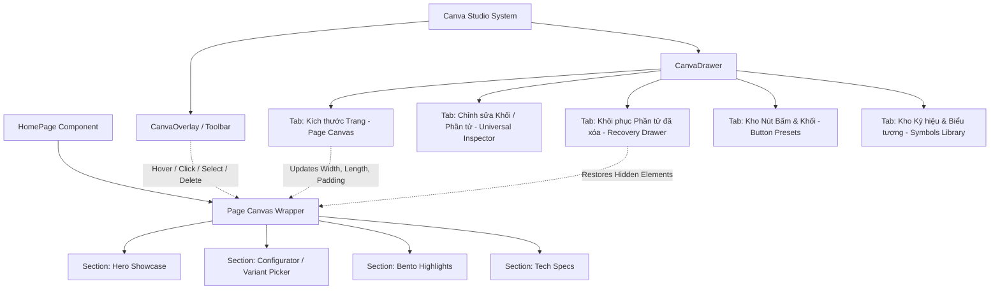

# Đặc Tả Thiết Kế: Canva Studio Universal Canvas, Page Resizer & Expanded Asset Library

**Ngày lập:** 27/09/2026  
**Trạng thái:** Đã phê duyệt (Approved)  
**Phạm vi:** Frontend (`frontend/src/`) & Hệ sinh thái Canva Studio (`components/common/canva/`)

---

## 1. Tổng quan & Mục tiêu Dự án (Overview & Goals)

Canva Studio hiện tại đã hỗ trợ chèn một số phần tử nổi (floating elements) và tùy chỉnh một số khối cơ bản. Tuy nhiên, người dùng cần sự tự do sáng tạo toàn diện ở cấp độ trình xây dựng trang (Page Builder):
1. **Quản lý kích thước trang (Page Canvas Dimensions: Length + Width):** Khả năng tùy chỉnh trực tiếp chiều rộng (*Width*), chiều cao/độ dài tối thiểu (*Min-Height / Length*), khoảng đệm (*Padding*), và chế độ căn giữa của toàn bộ trang web hoặc từng khối.
2. **Chuyển đổi toàn bộ UI thành Universal Editable, Deletable & Creatable:** Không còn bất kỳ phần tử nào trên trang bị "khóa cứng" (hardcoded/locked). Người dùng có thể rê chuột chọn bất kỳ nút bấm, thẻ Bento, dòng thông số kỹ thuật, huy hiệu, tiêu đề nào để:
   - Sửa nội dung chữ trực tiếp
   - Đổi kiểu dáng giao diện (màu sắc, gradient, viền, bo góc, bóng đổ)
   - Xóa / Ẩn phần tử (*Delete/Hide*) ngay lập tức bằng phím `Delete` hoặc nút thùng rác
   - Khôi phục lại các phần tử đã xóa bất cứ lúc nào thông qua ngăn kéo *Khôi phục phần tử*
   - Tạo mới các phần tử giao diện bất kỳ vào trang
3. **Mở rộng kho Mẫu Nút Bấm (Button Presets) & Ký hiệu, Biểu tượng (Symbols & Glyphs Library):** Tích hợp hàng loạt mẫu nút hiện đại (Apple Glassmorphism, 24K Luxury Gold, Cyberpunk Neon Glow, Titanium Minimalist, 3D Skeuomorphic) và kho ký hiệu đồ sộ (tiền tệ thế giới, đánh giá sao, huy hiệu chứng nhận, mũi tên điều hướng, glyphs công nghệ).

---

## 2. Kiến trúc Hệ Thống (System Architecture)



---

## 3. Chi Tiết Thiết Kế Các Phân Hệ

### Phân hệ 1: Quản Lý Kích Thước Trang (Page Canvas Dimensions: Length + Width)

#### 1. Cơ chế hoạt động:
- Khung nội dung website được bọc trong container `<main id="page-canvas-wrapper">`.
- Trạng thái `pageDimensions` được quản lý tại `HomePage.jsx` và đồng bộ vào `blockStyles['page-canvas']`:
  ```javascript
  {
    widthMode: 'custom', // 'full' | '1920' | '1600' | '1440' | '1200' | '768' | '390' | 'custom'
    customWidth: '100%',  // e.g., '1440px' or '100%'
    minHeight: 'auto',    // e.g., 'auto', '100vh', '1500px', '2500px'
    paddingX: 0,          // 0px - 80px
    paddingY: 0,          // 0px - 80px
    backgroundColor: '#000000',
    align: 'center'       // 'center' | 'left'
  }
  ```

#### 2. Giao diện điều khiển trong CanvaDrawer (Tab "Kích thước Trang"):
- **Nút Preset nhanh:**
  - 🖥️ Toàn màn hình (100% Full Width)
  - 🖥️ UltraWide (1920px)
  - 💻 MacBook Retina Pro (1600px)
  - 💻 Laptop Standard (1440px)
  - 🖥️ Desktop Tiêu Chuẩn (1200px)
  - 📱 Tablet iPad (768px)
  - 📱 Mobile iPhone (390px)
- **Thanh trượt & Ô nhập số chi tiết:**
  - Chiều rộng (Width): Slider `320px` - `2560px` kèm ô nhập số & chọn đơn vị (`px` / `%`).
  - Chiều cao tối thiểu / Độ dài (Length / Min-Height): Slider `600px` - `5000px` hoặc `100vh`.
  - Đệm lề (Padding X/Y): Slider `0px` - `80px`.
  - Màu nền trang web (Background Color/Gradient): Chọn từ bảng màu Luxury Color Palette.

---

### Phân hệ 2: Universal Editable, Deletable & Creatable UI System

#### 1. Universal Selection & Hover:
- Mỗi phần tử UI (nút CTA, tiêu đề, đoạn văn bản, bảng giá, thẻ Bento, dòng thông số kỹ thuật, huy hiệu, container) được gán thuộc tính `data-block-id="<unique-id>"`.
- Khi `isEditMode === true`:
  - Hover chuột vào phần tử: Viền xanh mờ `outline outline-1 outline-cyan-500/60 transition-all cursor-pointer`.
  - Click vào phần tử: Đặt `activeBlockId = id`, hiển thị viền sáng `ring-2 ring-[#0071e3] shadow-lg shadow-blue-500/20`.
  - Tự động hiển thị **Floating Mini Action Bar** trên đầu phần tử:
    - `[✏️ Sửa]` Mở bảng thuộc tính hoặc kích hoạt inline text editing.
    - `[🎨 Kiểu dáng]` Mở Canva Drawer chỉnh màu sắc, bo góc, đổ bóng, viền.
    - `[🗑️ Xóa/Ẩn]` Đưa ID phần tử vào danh sách `hiddenElements`.
    - `[📋 Nhân bản]` Tạo bản sao của phần tử.

#### 2. Universal Delete / Hide & Phím tắt:
- Khi một phần tử đang được chọn (`activeBlockId`), người dùng có thể:
  - Nhấp vào biểu tượng thùng rác trên Floating Mini Bar hoặc trong Canva Drawer.
  - Hoặc ấn phím **`Delete`** / **`Backspace`** trên bàn phím.
- Phần tử lập tức biến mất khỏi giao diện và được ghi nhận vào danh sách `hiddenElements`:
  ```javascript
  const [hiddenElements, setHiddenElements] = useState([]);
  // Khi xóa: setHiddenElements(prev => [...new Set([...prev, targetId])]);
  ```

#### 3. Quản lý Khôi phục Phần tử đã xóa (Recovery Drawer):
- Thêm tab **"Khôi phục Phần tử" (Restore Elements)** trong `CanvaDrawer`:
  - Liệt kê toàn bộ các phần tử đang bị ẩn/xóa trên trang hiện tại, có nhãn rõ ràng (ví dụ: *"Nút Mua Ngay (Hero CTA)"*, *"Thẻ Bento 01: Micro-OLED"*, *"Dòng thông số: Trọng lượng"*...).
  - Mỗi mục có nút **"Khôi phục" (Restore)** màu xanh lá.
  - Khi nhấp Khôi phục, phần tử ngay lập tức xuất hiện trở lại tại vị trí ban đầu.
  - Nút **"Khôi phục tất cả" (Restore All)** để hoàn tác nhanh toàn bộ trang.

#### 4. Tạo Mới Phần Tử (Create New Elements):
- Trong CanvaDrawer, mục "+ Tạo Mới":
  - **Nút Bấm Mới (Button):** Tạo nút với văn bản tùy ý, chọn mẫu style có sẵn, liên kết hành động (Mở giỏ hàng, cuộn đến khối, mở link URL).
  - **Văn bản / Tiêu đề (Heading/Paragraph):** Tạo tiêu đề H1-H4 hoặc đoạn văn bản với font chữ sang trọng.
  - **Huy hiệu (Badge Pill):** Tạo nhãn đặc sắc (VD: *"Hot", "Sale 20%", "New 2026"*).
  - **Khung chứa (Card/Container):** Khung kính mờ Glassmorphism hoặc khung viền vàng Gold.
  - **Hình ảnh / Slider / Icon:** Kéo thả tự do trên canvas.

---

### Phân hệ 3: Kho Mẫu Nút Bấm & Ký Hiệu / Biểu Tượng Siêu Phong Phú

#### 1. Bộ sưu tập Nút Bấm Đẳng Cấp (Button Presets):
1. **Apple Liquid Glass:** `backgroundColor: 'rgba(255, 255, 255, 0.12)', backdropFilter: 'blur(30px)', border: '1px solid rgba(255, 255, 255, 0.25)', borderRadius: '9999px', color: '#ffffff'`.
2. **24K Luxury Gold Foil:** `background: 'linear-gradient(135deg, #fde047 0%, #ca8a04 100%)', color: '#000000', boxShadow: '0 0 25px rgba(234, 179, 8, 0.45)', fontWeight: '700'`.
3. **Cyberpunk Neon Cyan:** `backgroundColor: 'rgba(6, 182, 212, 0.15)', border: '1.5px solid #06b6d4', color: '#22d3ee', boxShadow: '0 0 20px rgba(6, 182, 212, 0.5)'`.
4. **Emerald Laser Glow:** `background: 'linear-gradient(135deg, #10b981 0%, #059669 100%)', color: '#ffffff', boxShadow: '0 0 25px rgba(16, 185, 129, 0.4)'`.
5. **Ruby Crimson Pulse:** `background: 'linear-gradient(135deg, #f43f5e 0%, #e11d48 100%)', color: '#ffffff', boxShadow: '0 0 25px rgba(244, 63, 94, 0.4)'`.
6. **Violet Space Cyber:** `background: 'linear-gradient(135deg, #a855f7 0%, #7e22ce 100%)', color: '#ffffff', boxShadow: '0 0 25px rgba(168, 85, 247, 0.4)'`.
7. **Titanium Minimalist Pill:** `border: '1px solid rgba(255, 255, 255, 0.2)', backgroundColor: 'transparent', color: '#f5f5f7'`.
8. **3D Skeuomorphic Depth:** `backgroundColor: '#1f1f23', border: '1px solid #333338', boxShadow: '0 6px 0 #0d0d0f, 0 10px 20px rgba(0,0,0,0.5)', borderRadius: '16px'`.
9. **Quick Buy Lightning:** Kèm icon tia sét `Zap`, gradient vàng cam nổi bật.
10. **Cart Pill Button:** Kèm icon giỏ hàng `ShoppingBag` và badge số lượng.
11. **Concierge Hotline:** Kèm icon tai nghe `Headphones` / điện thoại phục vụ khách VIP.

#### 2. Kho Ký Hiệu & Biểu Tượng Phong Phú (Symbols & Icons Library):
- **Phân loại Tiền Tệ (Currencies):** `₫` (VND), `$` (USD), `€` (EUR), `£` (GBP), `¥` (JPY), `﷼` (SAR), `₿` (Bitcoin), `₩` (KRW), `₺` (TRY), `₹` (INR), `₽` (RUB).
- **Phân loại Đánh Giá & Xếp Hạng:** `★★★★★`, `★★★★☆`, `✦ ✦ ✦`, `✪ ✪ ✪`, `🌟`, `💫`, `✨`.
- **Phân loại Chứng Nhận Uy Tín (Trust Badges):**
  - `🛡️` 100% Hàng Chính Hãng
  - `🚀` Giao Hàng Siêu Tốc
  - `🔒` Thanh Toán Bảo Mật SSL
  - `💎` Chuẩn Chế Tác Luxury
  - `👑` Đặc Quyền Hội Viên VIP
  - `🏆` Giải Thưởng Quốc Tế
  - `⚡` Kích Hoạt Tức Thì
  - `✓` Đạt Tiêu Chuẩn ISO
- **Phân loại Mũi Tên & Điều Hướng:** `➔`, `➜`, `➝`, `➞`, `➢`, `➤`, `➥`, `⮞`, `⮡`, `❯`, `▶`.
- **Phân loại Ký Tự Công Nghệ & Nghệ Thuật:** `` (Apple), `❖` (Aura), `⬡` (Hexagon), `⬢`, `⟡` (Diamond Star), `⟢`, `⟣`, `❄` (Snowflake).
- **Phân loại Biểu Tượng E-Commerce:** `🛒`, `🛍️`, `📦`, `🎁`, `🏷️`, `💳`, `📱`, `🎧`, `⌚`, `👓`, `🔥`, `💯`.

---

## 4. Quản Lý Trạng Thái & Lưu Trữ (State Management & Persistence)

- Mọi tùy biến kích thước trang, các phần tử bị ẩn/xóa, nội dung chỉnh sửa, và style mới được quản lý tập trung trong `HomePage.jsx`:
  - `pageDimensions`: Lưu kích thước toàn trang (`width`, `minHeight`, `padding`, v.v.).
  - `hiddenElements`: Mảng các ID phần tử đang bị ẩn/xóa.
  - `blockStyles`: Map chứa styles tùy biến của từng block và phần tử.
  - `textOverrides`: Map chứa nội dung văn bản tùy biến.
  - `canvasElements`: Mảng các phần tử đồ họa được tạo mới thêm vào.
- Khi người dùng ấn **"Lưu Thay Đổi" (Save)** trên `LiveEditorBar`:
  - Dữ liệu được đóng gói vào payload và gửi lưu trữ vĩnh viễn vào cơ sở dữ liệu qua API backend `adminApi.updateProduct()` hoặc `localStorage` để tải lại mượt mà không bao giờ mất.

---

## 5. Kế Hoạch Kiểm Thử & Xác Nhận (Verification & Testing Strategy)

1. **Kiểm tra Kích thước Trang:**
   - Chọn lần lượt từng preset (100%, 1920px, 1440px, 1200px, 768px, 390px).
   - Xác nhận khung trang co giãn mượt mà, căn giữa đẹp mắt và không bị vỡ giao diện.
2. **Kiểm tra Sửa, Xóa, Khôi phục Phần tử:**
   - Bật Edit Mode, rê chuột và nhấp vào từng phần tử: nút bấm, thẻ bento, thông số kỹ thuật.
   - Nhấn Xóa (hoặc phím Delete) -> Xác nhận phần tử biến mất ngay lập tức.
   - Mở tab "Khôi phục Phần tử" -> Thấy phần tử vừa xóa -> Nhấp "Khôi phục" -> Phần tử lập tức xuất hiện trở lại đúng vị trí.
3. **Kiểm tra Tạo Mới & Mẫu Nút Bấm / Ký Hiệu:**
   - Nhấp chèn thử các mẫu nút: Apple Liquid Glass, 24K Gold, Cyberpunk Neon.
   - Nhấp chèn thử các ký hiệu: `₫`, `$`, `★★★★★`, `🛡️`, ``.
   - Xác nhận các phần tử hiển thị sắc nét, kéo thả và tùy chỉnh kích thước, màu sắc tự do.
4. **Kiểm tra Tính toàn vẹn của Website:**
   - Đảm bảo các chức năng mua hàng, chuyển đổi tiền tệ USD/VND/SAR, đổi ngôn ngữ EN/VI/AR vẫn hoạt động bình thường 100%.
